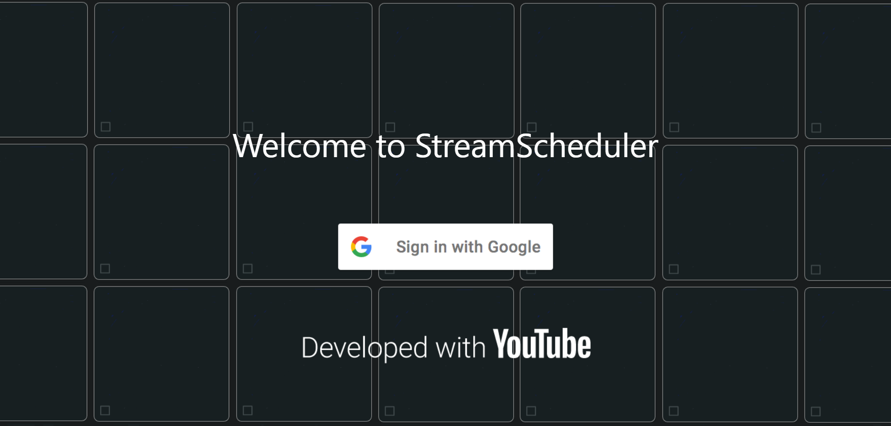

# StreamScheduler 

### StreamScheduler is a management app for you to track YouTube livestreams of your subscriptions. This app streamlines the experience of finding livestreams, giving you unprecendented control over searching, sorting and listing all the upcoming and currently live streams that YouTube cannot do. Looking up YouTube livestreams has never been easier. Check out the user guide [here](https://github.com/euph00/StreamScheduler/blob/main/docs/UserGuide.md).
\
Testing site is hosted at https://euph00.github.io/StreamScheduler/

Only authorised users are able to test the app currently. Contact `euph.f1eur@gmail.com` for access.
