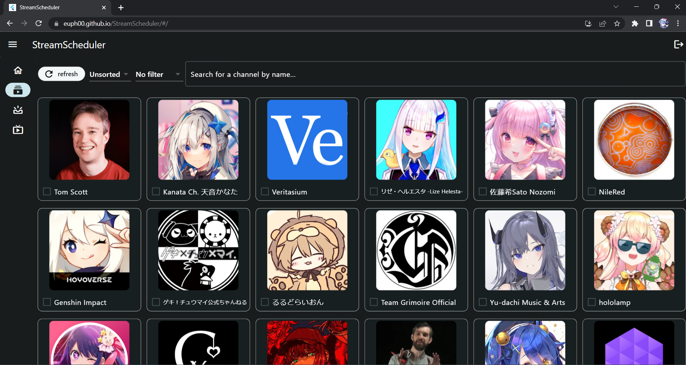
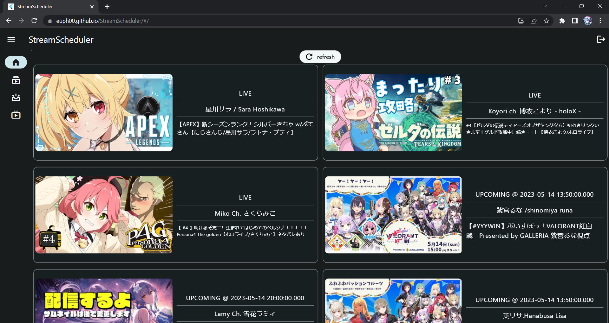
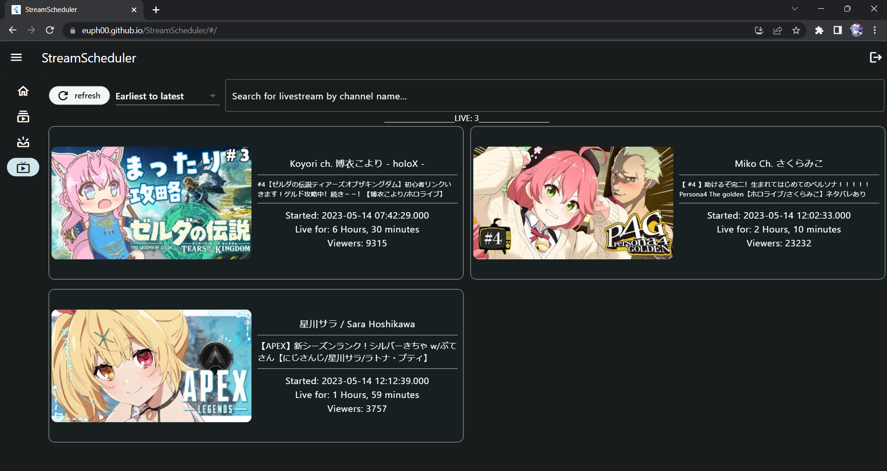

# What is StreamScheduler? 

Have you ever opened your YouTube subscriptions page looking for live streams from your favourite channels, only to realise that the subscriptions page is a mess? The ordering of videos on the YouTube subscriptions page can often seem arbitrary, and it is often difficult to find upcoming livestreams as they are not displayed at the top of the page, resulting in users having to check the pages of each specific channel to find out if that channel has an upcoming livestream.

This is where SteamScheduler comes in. StreamScheduler is a management app for you to track YouTube livestreams of your subscriptions. This app streamlines the experience of finding livestreams, giving you unprecendented control over searching, sorting and listing all the upcoming and currently live streams that YouTube cannot do. Looking up YouTube livestreams has never been easier.

---
# Table of contents
- [What is StreamScheduler? ](#what-is-streamscheduler-)
- [Table of contents](#table-of-contents)
- [Using this guide ](#using-this-guide-)
  - [Some symbols you may encounter in this guide](#some-symbols-you-may-encounter-in-this-guide)
- [Quick Start ](#quick-start-)
- [How to use: Subscriptions page ](#how-to-use-subscriptions-page-)
  - [Features](#features)
    - [**List subscriptions**](#list-subscriptions)
    - [**Add/Remove subscriptions from being tracked** ](#addremove-subscriptions-from-being-tracked-)
    - [**Sort subscriptons**](#sort-subscriptons)
    - [**Filter subscriptions**](#filter-subscriptions)
    - [**Search by channel name**](#search-by-channel-name)
    - [**Double click to open channel page**](#double-click-to-open-channel-page)
- [How to use: Home page ](#how-to-use-home-page-)
  - [Features](#features-1)
    - [**Display activity summary**](#display-activity-summary)
    - [**Refresh**](#refresh)
    - [**Double click to open stream page**](#double-click-to-open-stream-page)
- [How to use: Upcoming page ](#how-to-use-upcoming-page-)
  - [Features](#features-2)
    - [**List upcoming streams**](#list-upcoming-streams)
    - [**Refresh**](#refresh-1)
    - [**Sort upcoming streams**](#sort-upcoming-streams)
    - [**Search for upcoming streams by channel name**](#search-for-upcoming-streams-by-channel-name)
    - [**Double click to open stream page**](#double-click-to-open-stream-page-1)
- [How to use: Live page ](#how-to-use-live-page-)
  - [Features](#features-3)
    - [**List live streams**](#list-live-streams)
    - [**Refresh**](#refresh-2)
    - [**Sort upcoming streams**](#sort-upcoming-streams-1)
    - [**Search for upcoming streams by channel name**](#search-for-upcoming-streams-by-channel-name-1)
    - [**Double click to open stream page**](#double-click-to-open-stream-page-2)
- [General features](#general-features)
  - [Signing out](#signing-out)
  - [Saving your data](#saving-your-data)
- [Appendix ](#appendix-)
  - [Known issues ](#known-issues-)
    - [**Filter/Sort/Search conditions not saving properly**](#filtersortsearch-conditions-not-saving-properly)
    - [**Login status times out silently**](#login-status-times-out-silently)

---

# Using this guide 

* If you are using StreamScheduler for the first time, do consider taking a look at the [Quick Start](#quickstart) section.
* If you are facing an issue, take a look at the [Known Issues](#knownissues) section.

## Some symbols you may encounter in this guide
This guide will draw your attention to certain noteworthy points using symbols, such as:

:information_source: Information that is good to note.

:bulb: Tips to improve your experience using StreamScheduler.

:warning: Warnings about known flaws or issues to take note of, so that the app behaves as expected.

---

# Quick Start 

1. Access the web app [here](https://euph00.github.io/StreamScheduler/).
2. Click the `Sign in with Google` button to start the sign in process.
3. Select the correct Google account you use to watch YouTube.
4. On startup, the [Home page](#homepage) should be blank if this is the first time you are using StreamScheduler on that device.
5. Go to the [Subscriptions page](#subscriptionspage) to start adding channels for StreamScheduler to track.
6. Press the `refresh` button to see the updated livestreaming information in the [home](#homepage), [upcoming](#upcomingpage) and [live](#livepage) pages.
7. Refer to the [Features Summary](#featuressummary) or the section detailing each page for the features available on each page.

:information_source: **Platform support**
* Threre are no plans to support a macOS/Windows app. Please use the webapp on these platforms.
* Support for Android and iOS will be coming soon.
* Do use the webapp on tablets.

:warning: **Do not use the webapp on mobile**
* There are formatting issues with the web application when viewed on most smartphone browsers. For these platforms, do use the mobile app that will be released soon.

---

# How to use: Subscriptions page 

Sample subscription page layout

## Features
### **List subscriptions**
This page lists your subscribed channels. However, this page does not update in real time. Should you have just subscribed or unsubscribed from a channel on the YouTube app/website, you will need to press the `refresh` button at the upper left corner of the page to see the changes reflected.

:warning: Do not spam click the refresh button.

* Refer to [known issues](#knownissues) if your latest data is not being reflected.

### **Add/Remove subscriptions from being tracked** 
In each subscription box, you can check or uncheck the checkbox. A subscription that is checked is being tracked by StreamScheduler. This means that the upcoming and live streams of this channel will be reflected in the [home](#homepage), [upcoming](#upcomingpage) and [live](#livepage) pages. Unchecked susbcriptions will not be tracked.

### **Sort subscriptons**
At the top of the subscriptions page, you will see a dropdown that says `Unsorted` by default. Clicking on this dropdown will allow you to choose between different sorting options for channels that show up on the subscriptions page.

:bulb: The sorting order remains even after you add filters or search by channel name.

### **Filter subscriptions**
At the top of the subscriptions page, you will see a dropdown that says `No filter` by default. Clicking on this dropdown will allow you to choose between different filtering options for channels that show up on the subscriptions page.

:bulb: The filtering rule remains even after you sort or search by channel name.

:warning: There could be a case where the UI shows `No filter`, but a filter is actually being applied.

* This is a [known issue](#knownissues). If your subscriptions are not showing up as expected, please try to click on the filtering options and select `No filter` again.

### **Search by channel name**
At the top of the subscriptions page, you will see a text field that says `Search for a channel by name...`. Key in the channel name you are looking for in order to search for it.

:warning: There could be a case where the UI shows that the search bar is empty, but the displayed channels are being filtered by name.

* This is a [known issue](#knownissues). If your subscriptions are not showing up as expected, please try to click on the search bar and press the `enter` key.

### **Double click to open channel page**
Double clicking on a particular channel's box on this page will open a new tab that leads to the channel's page on YouTube.

---

# How to use: Home page 

Sample home page layout

## Features
### **Display activity summary**
This page lists all the live and upcoming streams of your [tracked channels](#channeltracking).

### **Refresh**
At the top of the home page, you will see a `refresh` button. Clicking this button will update the information regarding the upcoming and live streams of your [tracked channels](#channeltracking).

:warning: Do not spam click the refresh button.

* The information updating takes a moment. A loading indicator will be added in the future. If waiting 5 seconds does not solve the issue, refer to [known issues](#knownissues) for other potential fixes.

### **Double click to open stream page**
Double clicking on a particular event's box on this page will open a new tab that leads to the live event's video page on YouTube.

---

# How to use: Upcoming page 

Sample upcoming page layout

## Features
### **List upcoming streams**
This page lists all the upcoming streams of your [tracked channels](#channeltracking).

### **Refresh**
At the top left corner of the upcoming page, you will see a button that says `refresh`. Clicking this button will update the information regarding the upcoming streams of your [tracked channels](#channeltracking).

:warning: Do not spam click the refresh button.

* The information updating takes a moment. A loading indicator will be added in the future. If waiting 5 seconds does not solve the issue, refer to [known issues](#knownissues) for other potential fixes.

### **Sort upcoming streams**
At the top of the upcoming page, you will see a dropdown that says `Earliest to latest` by default. Clicking on this will open a dropdown that allows you to select the sorting option for the upcoming streams.

:information_source: By default, upcoming streams are sorted by their scheduled start timings.

* This means that a stream that starts at a earlier time will show up before a stream that starts at a later time in the list. For example, a stream that starts at 2023/05/14 13:50 will be displayed before one that starts at 2023/05/15 14:00.

### **Search for upcoming streams by channel name**
At the top of the upcoming page, you will see a text field that says `Search for upcoming livestream by channel name...`. Key in the channel name for which you want to see streams from to display them.

:warning: There could be a case where the UI shows that the search bar is empty, but the displayed items are being filtered by channel name.

* This is a [known issue](#knownissues). If your items are not showing up as expected, please try to click on the search bar and press the `enter` key.

### **Double click to open stream page**
Double clicking on a particular event's box on this page will open a new tab that leads to the upcoming stream's video page on YouTube.

---

# How to use: Live page 

Sample live page layout

## Features
### **List live streams**
This page lists all the live streams of your [tracked channels](#channeltracking).

### **Refresh**
At the top left corner of the live page, you will see a button that says `refresh`. Clicking this button will update the information regarding the live streams of your [tracked channels](#channeltracking).

:warning: Do not spam click the refresh button.

* The information updating takes a moment. A loading indicator will be added in the future. If waiting 5 seconds does not solve the issue, refer to [known issues](#knownissues) for other potential fixes.

### **Sort upcoming streams**
At the top of the live page, you will see a dropdown that says `Earliest to latest` by default. Clicking on this will open a dropdown that allows you to select the sorting option for the live streams.

:information_source: By default, live streams are sorted by their scheduled start timings.

* This means that a stream that starts at a earlier time will show up before a stream that starts at a later time in the list. For example, a stream that starts at 2023/05/14 13:50 will be displayed before one that starts at 2023/05/15 14:00.

### **Search for upcoming streams by channel name**
At the top of the live page, you will see a text field that says `Search for livestream by channel name...`. Key in the channel name for which you want to see streams from to display them.

:warning: There could be a case where the UI shows that the search bar is empty, but the displayed items are being filtered by channel name.

* This is a [known issue](#knownissues). If your items are not showing up as expected, please try to click on the search bar and press the `enter` key.

### **Double click to open stream page**
Double clicking on a particular event's box on this page will open a new tab that leads to the live stream's video page on YouTube.

---

# General features
## Signing out
At the top right hand corner of the screen, you will see a logout icon. Clicking on that icon will log you out of the app and return you to the sign-in screen. You may then click the sign in button again to sign in to a different account, or re-sign in with the same account.

## Saving your data
Your [tracked channels](#channeltracking) are automatically saved. Signing out and signing back in on the same device will result in the same channels remaining checked in your [subscriptions page](#subscriptionspage). The [home](#homepage), [upcoming](#upcomingpage) and [live](#livepage) pages will also automatically update on sign-in to fetch the latest data for these saved tracked channels.

---

# Appendix 
## Known issues 

### **Filter/Sort/Search conditions not saving properly**
PROBLEM: After applying filter/sort/search conditions on the subscriptions, upcoming or live pages, switching to another page and then switching back, the respective dropdowns/search bar are reset to their default values but the displayed items remain filtered/sorted by the previously applied conditions.

SOLUTION: Reselect the appropriate filter/sort/search conditions as desired.

### **Login status times out silently**
PROBLEM: After logging in for an extended period of time, the OAuth session key may expire silently. This results in attempts at updating information in the app by requesting data from YouTube to fail. App appears unresponsive.

Solution: [Sign out](#signing-out) and sign back in.