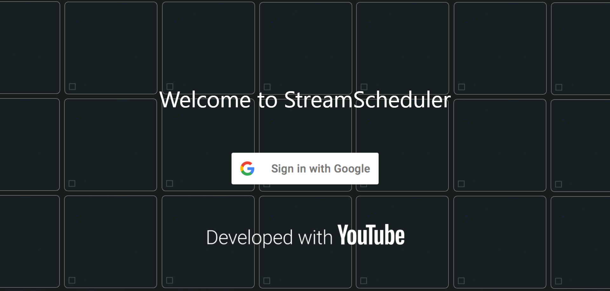

# What is StreamScheduler? 

Have you ever opened your YouTube subscriptions page looking for live streams from your favourite channels, only to realise that the subscriptions page is a mess? The ordering of videos on the YouTube subscriptions page can often seem arbitrary, and it is often difficult to find upcoming livestreams as they are not displayed at the top of the page, resulting in users having to check the pages of each specific channel to find out if that channel has an upcoming livestream.

This is where SteamScheduler comes in. StreamScheduler is a management app for you to track YouTube livestreams of your subscriptions. This app streamlines the experience of finding livestreams, giving you unprecendented control over searching, sorting and listing all the upcoming and currently live streams that YouTube cannot do. Looking up YouTube livestreams has never been easier.

---

# Using this guide 

* If you are using StreamScheduler for the first time, do consider taking a look at the [Quick Start](#quickstart) section.
* If you are looking for a specific feature, take a look at the [Features Summary](#featuressummary) 

## Some symbols you may encounter in this guide
This guide will draw your attention to certain noteworthy points using symbols, such as:

:information_source: Information that is good to note.

:bulb: Tips to improve your experience using StreamScheduler.

:warning: Warnings about known flaws or issues to take note of, so that the app behaves as expected.

---

# Quick Start 

1. Access the web app [here](https://euph00.github.io/StreamScheduler/).
2. Click the `Sign in with Google` button to start the sign in process.
3. Select the correct Google account you use to watch YouTube.
4. Go to the [Subscriptions page](#subscriptionspage) to start adding channels for StreamScheduler to track.
5. Press the `refresh` button to see the updated livestreaming information in the [home](#homepage), [upcoming](#upcomingpage) and [live](#livepage) pages.
6. Refer to the [Features Summary](#featuressummary) or the section detailing each page for the features available on each page.

:information_source: **Platform support**
* Threre are no plans to support a macOS/Windows app. Please use the webapp on these platforms.
* Support for Android and iOS will be coming soon.
* Do use the webapp on tablets.

:warning: **Do not use the webapp on mobile**
* There are formatting issues with the web application when viewed on most smartphone browsers. For these platforms, do use the mobile app that will be released soon.

